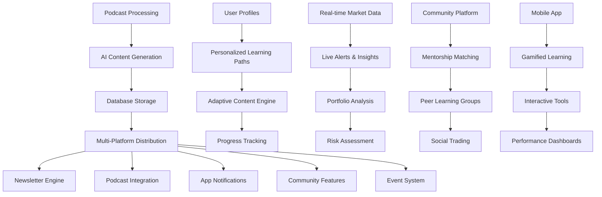

# InvestingDojo 2025 Transformation Roadmap
## From Podcast Automation to Retail Investor Intelligence Powerhouse

**Last Updated:** September 17, 2025
**Version:** 1.0
**Status:** Active Development

---

## 🚨 CRITICAL CONSTRAINTS

### ANY CHANGES TO `COMPLETE_DAILY_AUTOMATION.py` OR THE DATABASE MUST BE REQUESTED BEFORE COMMITTING

**This is a hard rule that cannot be broken.** The current automation system:
- ✅ Successfully processes 250+ RSS feeds daily
- ✅ Downloads and compresses MP3 files (<20MB)
- ✅ Uses Gemini AI for transcription with rate limiting
- ✅ Generates stories using SuperPrompt_Optimized.md with CrewAI integration
- ✅ **Pushes content to BOTH local AND remote databases simultaneously**
- ✅ Has production-ready error handling and logging
- ✅ Processes ~5-10 episodes daily = 10-20 stories

**DO NOT MODIFY** `COMPLETE_DAILY_AUTOMATION.py` or any database operations without explicit approval.

---

## 🎯 Executive Summary

This roadmap transforms InvestingDojo from a **podcast content automation machine** into a **comprehensive retail investor intelligence ecosystem**. The foundation is already world-class - we build upon it without disrupting the core automation that feeds both local and production databases.

### Current System Strengths (Preserve & Build Upon)
- **Sophisticated Content Pipeline**: RSS harvesting → MP3 processing → AI transcription → Dual story generation
- **Multi-Platform Architecture**: Newsletter, podcast, app, community, events optimization
- **Educational Framework**: White-to-black belt progression with family wealth focus
- **AI Integration**: Practical AI tools throughout the curriculum
- **Production-Ready**: Automated daily processing with comprehensive monitoring

### Transformation Vision
Create a **personalized investment intelligence ecosystem** that adapts to each retail investor's journey, provides real-time market insights, and builds generational wealth through systematic education.

---

## 📊 System Architecture Evolution

---

## 🗺️ Transformation Phases

### Phase 1: Personalization & Learning Foundation (Weeks 1-4)
**Goal:** Transform from static content delivery to adaptive learning ecosystem

#### ✅ Completed
- [x] Analyze current system capabilities and architecture
- [x] Understand user vision for retail investor education platform
- [x] Design personalized learning pathways for belt progression
- [x] Set up GitHub repository and commit codebase excluding sensitive data

#### 🔄 In Progress
- [ ] Create user profile and progress tracking system
- [ ] Develop AI-powered content recommendations engine
- [ ] Implement adaptive learning pathways based on belt levels
- [ ] Build personalized curriculum mapping

#### 📋 Planned
- [ ] Add user onboarding and assessment system
- [ ] Create learning milestone tracking
- [ ] Implement progress visualization dashboard
- [ ] Develop personalized study plans

### Phase 2: Market Intelligence Integration (Weeks 5-8)
**Goal:** Add real-time market data and portfolio analysis capabilities

#### 📋 Planned
- [ ] Implement real-time market data integration (Yahoo Finance, Alpha Vantage)
- [ ] Create live market alerts and educational notifications
- [ ] Build interactive portfolio analysis tools
- [ ] Implement advanced risk assessment and scenario modeling
- [ ] Add market sentiment analysis and trend detection
- [ ] Develop portfolio performance tracking

### Phase 3: Community & Social Learning (Weeks 9-12)
**Goal:** Build peer learning and mentorship ecosystem

#### 📋 Planned
- [ ] Design community mentorship and peer learning platform
- [ ] Create group challenge and accountability features
- [ ] Implement social trading and portfolio sharing
- [ ] Build discussion forums and expert Q&A
- [ ] Add peer progress comparison and motivation features
- [ ] Develop mentorship matching algorithm

### Phase 4: Advanced Tools & Analytics (Weeks 13-16)
**Goal:** Add institutional-grade tools for retail users

#### 📋 Planned
- [ ] Build institutional-grade research tools for retail users
- [ ] Implement AI-powered investment strategy generation
- [ ] Add multi-asset class content generation (crypto, options, REITs)
- [ ] Develop performance tracking and ROI measurement dashboard
- [ ] Create advanced analytics for content effectiveness
- [ ] Build family wealth planning and generational tools

### Phase 5: Global Expansion & Monetization (Weeks 17-20)
**Goal:** Scale globally and implement revenue streams

#### 📋 Planned
- [ ] Add global market coverage and multi-language support
- [ ] Develop integration with trading platforms and brokers
- [ ] Implement subscription and monetization features
- [ ] Create educational events and live session integration
- [ ] Build mobile app with gamified learning experience
- [ ] Develop comprehensive testing and validation framework

---

## 🏗️ Technical Implementation Strategy

### Architecture Principles
1. **Build Upon Existing Strengths** - Don't break what's working
2. **Incremental Enhancement** - Add features without disrupting core automation
3. **User-Centric Design** - Every feature serves the retail investor journey
4. **Scalable Architecture** - Support growth from hundreds to millions of users
5. **Data-Driven Optimization** - Use analytics to continuously improve

### Database Strategy
- **PRESERVE EXISTING DATABASE OPERATIONS** - No changes to current import/sync process
- **Add New Tables** - Create separate tables for user profiles, progress tracking, etc.
- **Maintain Compatibility** - Ensure new features work with existing content structure
- **Performance Optimization** - Add indexing and caching for new features

### API Integration Strategy
- **Market Data**: Yahoo Finance, Alpha Vantage, Finnhub
- **Trading Platforms**: Interactive Brokers, TD Ameritrade, Robinhood
- **Social Features**: Custom implementation with moderation
- **Analytics**: Mixpanel, Google Analytics, custom dashboards

---

## 📈 Success Metrics

### User Engagement Metrics
- **Daily Active Users**: Target 10x increase within 6 months
- **Session Duration**: Target 15+ minutes average
- **Content Completion Rate**: Target 75% for recommended paths
- **Belt Progression Rate**: Target 60% users advancing within 3 months

### Content Performance Metrics
- **Personalization Effectiveness**: 40% improvement in user satisfaction
- **Recommendation Accuracy**: 85% click-through rate on personalized content
- **Community Engagement**: 50% of users participating in discussions
- **Mobile App Adoption**: 30% of users using mobile features

### Business Metrics
- **Revenue Growth**: Target 300% increase through subscriptions
- **User Retention**: Target 80% monthly retention
- **Market Expansion**: Target 10 new countries within 12 months
- **Partnership Revenue**: Target $500K from platform integrations

---

## 🔧 Development Guidelines

### Code Quality Standards
- **Testing**: 80%+ code coverage for new features
- **Documentation**: Comprehensive API documentation
- **Security**: SOC 2 compliance for user data
- **Performance**: <2 second response times for all features

### Deployment Strategy
- **Staging Environment**: Full testing before production
- **Feature Flags**: Gradual rollout of new features
- **Rollback Plan**: Ability to revert any feature within 1 hour
- **Monitoring**: Real-time alerting for performance issues

### Team Collaboration
- **Git Workflow**: Feature branches with pull request reviews
- **Documentation**: Weekly progress updates and roadmap reviews
- **Communication**: Daily standups and weekly planning sessions
- **Quality Assurance**: Automated testing and manual QA for all features

---

## 🚨 Risk Mitigation

### Technical Risks
- **Database Performance**: Monitor query performance, implement caching
- **API Rate Limits**: Implement intelligent queuing and fallback systems
- **Scalability**: Design for horizontal scaling from day one
- **Security**: Regular security audits and penetration testing

### Business Risks
- **User Adoption**: Focus on user experience and value delivery
- **Competition**: Differentiate through personalization and community
- **Regulatory Compliance**: Stay updated on financial regulations
- **Market Changes**: Build flexibility into the platform architecture

### Operational Risks
- **Team Bandwidth**: Prioritize features based on impact vs effort
- **Technical Debt**: Regular refactoring and code quality reviews
- **Vendor Dependencies**: Multiple provider options for critical services
- **Data Backup**: Comprehensive backup and disaster recovery plans

---

## 📅 Timeline & Milestones

### Month 1: Foundation (Weeks 1-4)
- ✅ GitHub setup and codebase organization
- 🔄 User profile system implementation
- 📋 AI recommendation engine design
- 📋 Learning pathway personalization

### Month 2: Intelligence Layer (Weeks 5-8)
- 📋 Real-time market data integration
- 📋 Portfolio analysis tools
- 📋 Risk assessment features
- 📋 Performance tracking dashboard

### Month 3: Community Building (Weeks 9-12)
- 📋 Mentorship platform
- 📋 Social learning features
- 📋 Group challenges and accountability
- 📋 Discussion forums and Q&A

### Month 4: Advanced Features (Weeks 13-16)
- 📋 Institutional-grade research tools
- 📋 Multi-asset class support
- 📋 Advanced analytics
- 📋 Family wealth planning

### Month 5: Scale & Monetize (Weeks 17-20)
- 📋 Global expansion
- 📋 Trading platform integrations
- 📋 Subscription system
- 📋 Mobile app launch

---

## 🎯 Next Steps

### Immediate Actions (This Week)
1. **Review and Approve Roadmap** - Confirm priorities and timeline
2. **Set Up Development Environment** - Ensure all team members have access
3. **Begin User Profile System** - Start with foundational personalization features
4. **Plan Phase 1 Implementation** - Detailed technical specifications

### Decision Points
1. **Technology Stack** - Confirm frameworks and tools for new features
2. **API Partnerships** - Select market data and trading platform integrations
3. **Mobile Strategy** - Native app vs progressive web app decision
4. **Monetization Model** - Subscription tiers and pricing strategy

---

## 📞 Contact & Communication

**Project Lead:** Dave Thackeray
**Technical Lead:** Kilo Code
**Repository:** https://github.com/davethackeray/dojo-2025

**Communication Channels:**
- Daily standups: 9:00 AM CET
- Weekly planning: Every Monday 2:00 PM CET
- Progress updates: Friday 4:00 PM CET
- Emergency contact: 24/7 availability for critical issues

---

**Remember: The core automation system feeding both databases MUST remain untouched. All new features build upon and enhance the existing world-class foundation without disrupting the critical content pipeline.**

*This roadmap represents our journey from automation excellence to investor intelligence leadership. Let's build the future of retail investor education!* 🚀